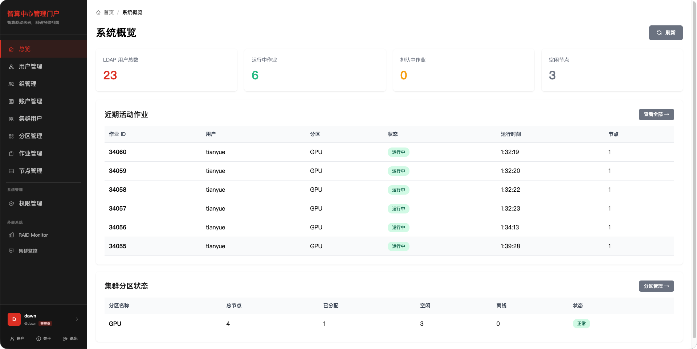
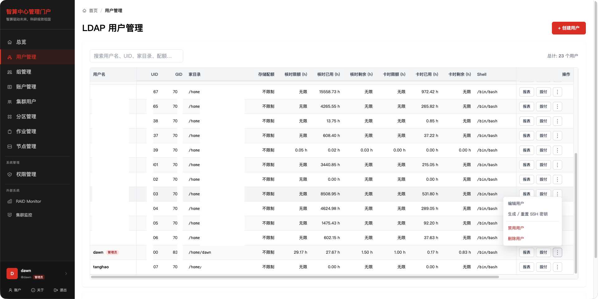
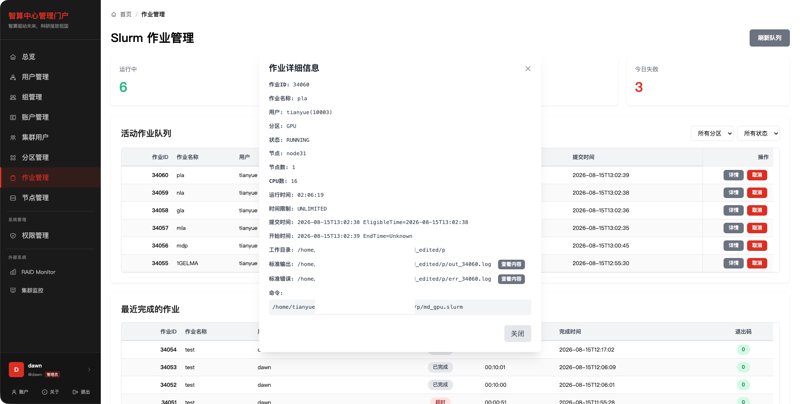

# openhpc_webui

`openhpc_webui` 是面向高校、科研机构和企业智算中心的轻量级中文管理门户。项目将 OpenLDAP 身份管理、Slurm 账户与关联、分区和节点配置、作业状态及输出查看集中到同一个 Web 界面，适合内网和离线环境。

当前版本：`0.3.0`

## 功能概览

| 模块 | 主要能力 |
| --- | --- |
| 系统总览 | LDAP 用户数、活动作业、空闲节点、近期作业和分区状态 |
| 用户管理 | LDAP 用户增删改、禁用、SSH 密钥、存储配额、核时/卡时和作业报表 |
| 组管理 | LDAP 组创建、编辑、删除及成员信息查看 |
| 账户管理 | Slurm 账户创建、编辑和删除 |
| 集群用户 | Slurm Association、QOS、默认 QOS、分区和 TRES Minutes 管理 |
| 分区管理 | Slurm 分区配置、节点状态统计及配置重载 |
| 节点管理 | 节点配置维护、Drain、Resume 和状态查看 |
| 作业管理 | 活动作业、近期完成作业、详情、取消及标准输出/错误查看 |
| 文件管理 | Home/系统路径分页浏览、隐藏项切换、文本编辑、上传下载、新建、重命名和删除 |
| 权限管理 | 门户管理员授权与撤销 |

页面资源随项目提供，不依赖外部 CDN。列表采用固定表头、对齐的数字和状态列，并在内容溢出时提供横向滚动。

## 权限模型

| 能力 | 管理员 | 普通用户 |
| --- | :---: | :---: |
| 系统总览和管理页面 | 是 | 否 |
| 查看全部活动及近期完成作业 | 是 | 是 |
| 查看作业详情 | 是 | 是 |
| 查看作业输出 | 任意作业 | 仅自己的作业 |
| 取消作业 | 任意作业 | 仅自己的作业 |
| 文件管理范围 | 系统根目录 `/` | LDAP Home 目录（页面中映射为 `/`） |
| 修改自己的 LDAP 密码 | 是 | 是 |

管理员由 `ADMIN_USERS` 配置，也可以在权限管理页面在线维护。普通用户访问管理员页面时会被重定向到作业页面。

## 界面预览

### 登录


### 系统总览



### 用户管理



### 作业管理



## 技术栈

- Python 3.9+
- FastAPI、Jinja2 和 Uvicorn
- ldap3 / OpenLDAP
- Slurm CLI：`sinfo`、`squeue`、`sacct`、`scontrol`、`sacctmgr`、`scancel`
- uv 依赖与环境管理
- Tailwind CSS CLI 4.x（仅在修改模板或前端脚本中的工具类后重新构建）

## 项目结构

```text
openhpc_webui/
├── openhpc_webui/
│   ├── application.py      # FastAPI 路由与接口
│   ├── cli.py              # 命令行入口
│   ├── core/               # 配置、认证和公共能力
│   ├── models/             # 请求与响应模型
│   └── services/           # LDAP、Slurm 和系统集成
├── templates/              # Jinja2 页面模板
├── static/                 # 离线 CSS、JavaScript 和图标
├── tests/                  # 自动化测试
├── docs/                   # 使用、部署和运维文档
├── env.example             # 环境变量示例
└── pyproject.toml          # 项目元数据与依赖
```

## 环境要求

运行门户的主机需要：

- 能够访问 OpenLDAP 服务；
- 安装 Slurm 客户端命令，并能连接 Slurm 控制端；
- 对节点和分区配置文件具有业务所需的读写权限；
- 使用 NFS 配额时安装并配置 `quota` / `setquota`；
- 生产环境具备 Nginx、Supervisor 或等效的进程管理能力。

Web 管理员身份不会绕过 Linux 文件权限或 Slurm 权限。

## 快速开始

从 PyPI 安装固定版本：

```bash
python3 -m venv .venv
.venv/bin/python -m pip install "openhpc-webui==0.3.0"
```

PyPI 安装不包含仓库级 `env.example` 和部署示例，完整配置及 systemd、升级、离线
安装方法见[PyPI 安装与使用指南](./docs/PYPI_USAGE.md)。

从源码启动开发环境：

```bash
uv sync
cp env.example .env
uv run uvicorn openhpc_webui.application:app --reload --port 6827
```

浏览器访问 `http://127.0.0.1:6827`。也可以使用项目命令启动监听在 `0.0.0.0:6827` 的服务：

```bash
uv run openhpc_webui
```

### 最小配置

编辑 `.env`，至少确认以下配置：

| 配置项 | 用途 |
| --- | --- |
| `LDAP_URI` | LDAP 服务地址 |
| `LDAP_BASE_DN` | LDAP Base DN |
| `LDAP_DEFAULT_BIND_DN` | 管理 Bind DN |
| `LDAP_DEFAULT_AUTHTOK` | 管理 Bind 密码 |
| `SECRET_KEY` | Session 签名密钥，生产环境不少于 32 个随机字符 |
| `AUTHORIZED` | 是否启用登录认证，生产环境必须为 `True` |
| `ADMIN_USERS` | 管理员用户名，多个值使用英文逗号分隔 |
| `FILE_UPLOAD_MAX_MB` | 文件管理单个上传文件大小上限，默认 1024 MB |
| `FILE_EDIT_MAX_KB` | 在线 UTF-8 文本编辑大小上限，默认 2048 KB |
| `SLURM_DEFAULT_ACCOUNT` | 创建 LDAP 用户时使用的默认 Slurm 账户 |
| `SLURM_CONFIG_DIR` | 节点与分区配置文件目录，默认 `/etc/slurm` |

完整配置说明见[技术指南](./docs/TECHNICAL_GUIDE.md)。

## 生产部署

生产环境建议由 Supervisor 管理 Uvicorn，并仅监听 `127.0.0.1:6827`；由 Nginx 提供 HTTPS 和反向代理。不要直接将开发服务器暴露到公网。

部署步骤、自签发证书、服务管理和升级方法见[生产部署指南](./docs/DEPLOYMENT.md)。

## 文档

- [版本调整与发布](./docs/RELEASING.md)：版本同步脚本、发布检查、GitHub Release 和 PyPI 流程
- [PyPI 安装与使用指南](./docs/PYPI_USAGE.md)：虚拟环境、配置、systemd、升级和离线安装
- [用户使用手册](./docs/USER_MANUAL.md)：管理员和普通用户的页面操作说明
- [技术指南](./docs/TECHNICAL_GUIDE.md)：配置、运行、架构、测试与故障排查
- [生产部署指南](./docs/DEPLOYMENT.md)：Supervisor、Nginx、HTTPS 和升级
- [磁盘配额指南](./docs/DISK_QUOTA.md)：XFS `/home` 配额启用、验证和 Web UI 配置
- [核时统计与额度拨付](./docs/SLURM_USAGE_AND_CREDITS.md)：统计口径、Slurm 命令、拨付算法和登录提示脚本
- [Rocky Linux 9 LDAP 部署](./docs/LDAP_ROCKY9.md)：OpenLDAP 安装与初始化
- [Rocky Linux 9 SSSD 接入](./docs/SSSD_LDAP_ROCKY9.md)：计算节点接入 LDAP 身份

## 验证与开发

```bash
./scripts/build_tailwind.sh
uv run python -m unittest discover -s tests
uv run python -m compileall -q openhpc_webui
```

Tailwind 构建入口为 `tailwind.css`，只扫描 `templates/` 和 `static/*.js` 中实际使用的类，并将压缩后的离线样式写入 `static/all-tailwind-classes-full-min.css`。

提交界面变更前，还应手动检查登录、用户、组、账户、集群用户、分区、节点、作业和权限页面，并附上桌面与窄屏截图。

## 安全建议

- 仅在受控内网开放门户，并使用防火墙限制来源。
- 生产环境启用 HTTPS，并将 `SESSION_HTTPS_ONLY` 设为 `True`。
- 不要提交 `.env`、LDAP 管理密码、Session 密钥或真实用户数据。
- 仅授予运行账户完成 LDAP、Slurm 和配置文件操作所需的最小权限。
- 定期审计管理员列表、Slurm 操作和应用日志。

本项目是集群管理辅助工具，不替代 Slurm、LDAP、监控平台或审计系统本身。
